# Operationalizing Mismatch Diagnosis in Urban Flood Governance

## Thesis-aligned diagnostic prototype

This repository is an executable companion to the master thesis:

**Operationalizing Mismatch Diagnosis in Urban Flood Governance:  
A Multimodal Vision–Language Framework for Dynamic Impact–Response Coordination**

**Author:** Wu Huijuan  
**Programme:** Transforming City Regions, RWTH Aachen University  
**Case:** May 2023 Emilia-Romagna flood

## Live demo

[Open the interactive Streamlit app](https://geoai-flood-mismatch-demo-mt2cs2m7ruoewdch4koyc3.streamlit.app/)

> **Data and evidence statement.** This repository brings together three
> distinct components: empirical maps and reported event-window counts from
> the master's thesis, a post-thesis 1 km QGIS scale comparison, and a separate
> 12-unit synthetic table used only to make the diagnostic formulas executable.
> The synthetic table is not the source of the thesis maps, reported counts or
> empirical interpretation.

## Empirical study represented by this repository

This repository accompanies the empirical analysis of the **May 2023
Emilia–Romagna flood**. The thesis aligns physically reconstructed flood
impact `I` and digitally mediated response/demand visibility `R` on consistent
spatial units. The submitted master's-thesis maps use a regular **5 km grid**.
This repository preserves those original figures and adds a clearly labelled
**1 km post-thesis QGIS refinement** as a scale-sensitivity comparison. The
refinement follows the same diagnostic definitions but does not retrospectively
replace or rewrite the thesis analysis.

### Empirical data basis

The thesis reports:

- 481 records with usable location assignments;
- 450 unique X post IDs;
- 106 records within the May 2023 event window;
- 100 unique analytical posts after event-window deduplication.

“Usable location assignment” includes both embedded geographic metadata and
validated text-based place-name geocoding. It does not mean that every record
contains original device-level GPS coordinates.

The event-window distribution is strongly urban-centred:

- Ravenna: 81 records;
- Faenza: 23 records;
- Conselice: 1 record;
- Sant’Agata sul Santerno: 1 record.

### Empirical finding

The thesis identifies a **moderate but spatially differentiated
response–impact mismatch**.

Urban centres tend to exhibit comparatively high response/demand visibility,
while several rural and low-lying agricultural areas combine high physical
impact with limited digitally mediated visibility.

This finding does not, by itself, prove an absence of operational response.
Response/demand visibility `R` is a mediated information signal and must be
interpreted together with accessibility conditions, official records and
post-flood intervention evidence.

## Original frameworks retained in the writing sample

| Overall research structure | CV–LLM methodological framework |
|---|---|
| 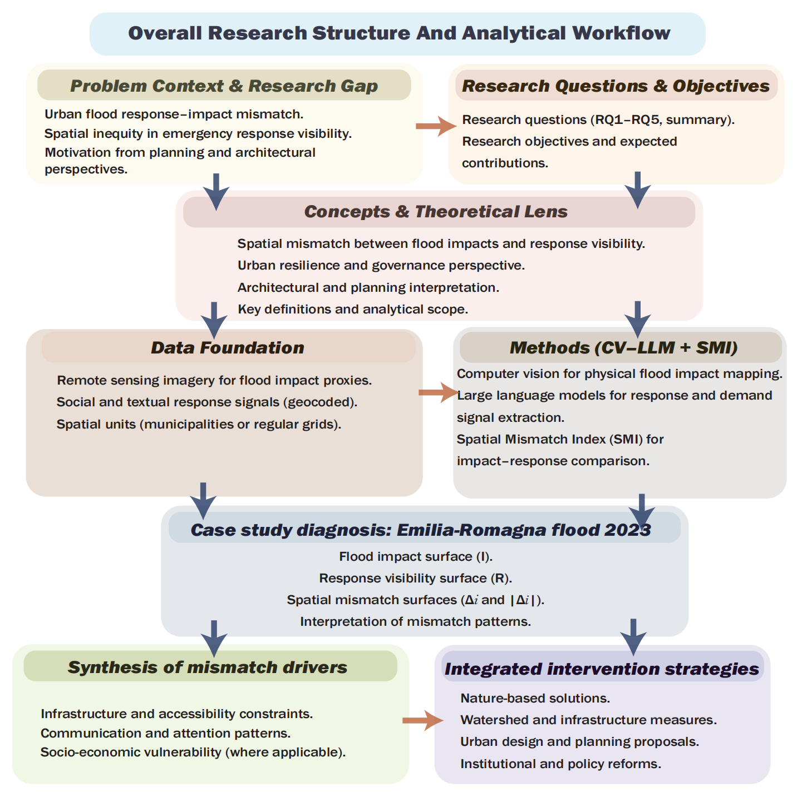 | 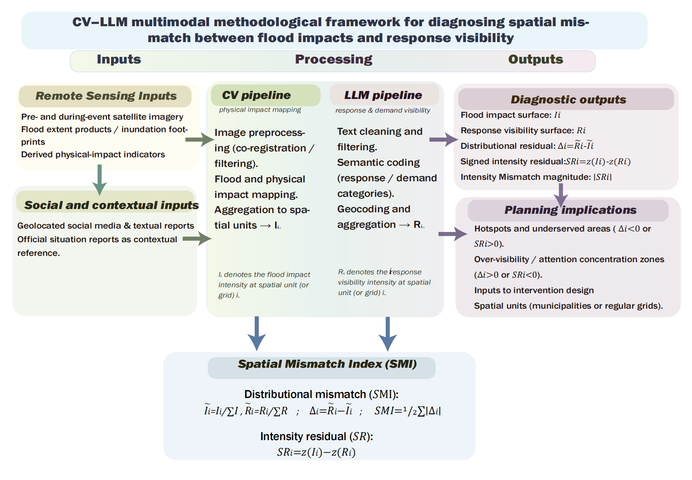 |

These are the original framework panels retained in the doctoral writing
sample. They are displayed here without redrawing or recolouring.

## Original 5 km maps and 1 km QGIS refinement

The left column preserves the master's-thesis map. The right column shows the
post-thesis 1 km refinement used for the scale comparison in the writing
sample. Changing grid support changes aggregation, zero counts,
standardisation and class breaks. Compare spatial structure and residual
direction rather than equal-looking colour shades or overall darkness.

### Data coverage and signal presence

| Original master's-thesis map (5 km) | Post-thesis QGIS refinement (1 km) |
|---|---|
| 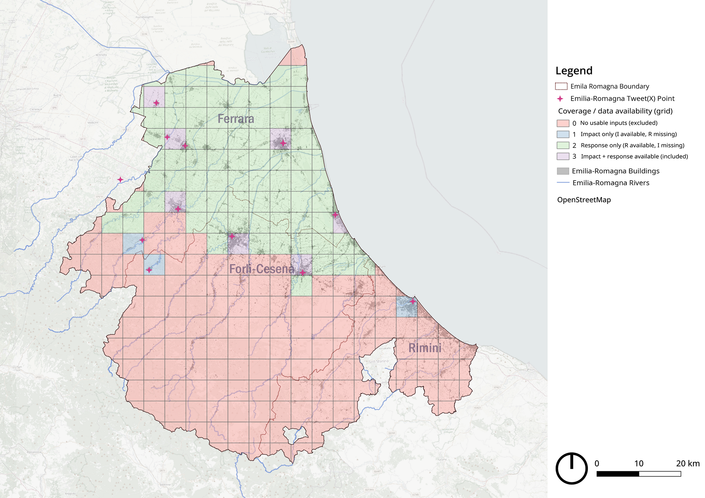 | 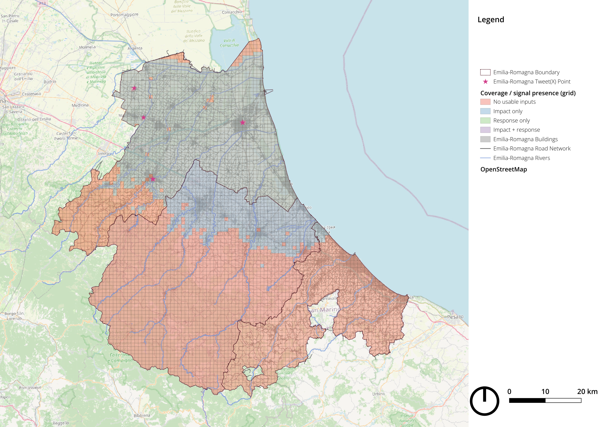 |

### Physical impact intensity I

| Original master's-thesis map (5 km) | Post-thesis QGIS refinement (1 km) |
|---|---|
| 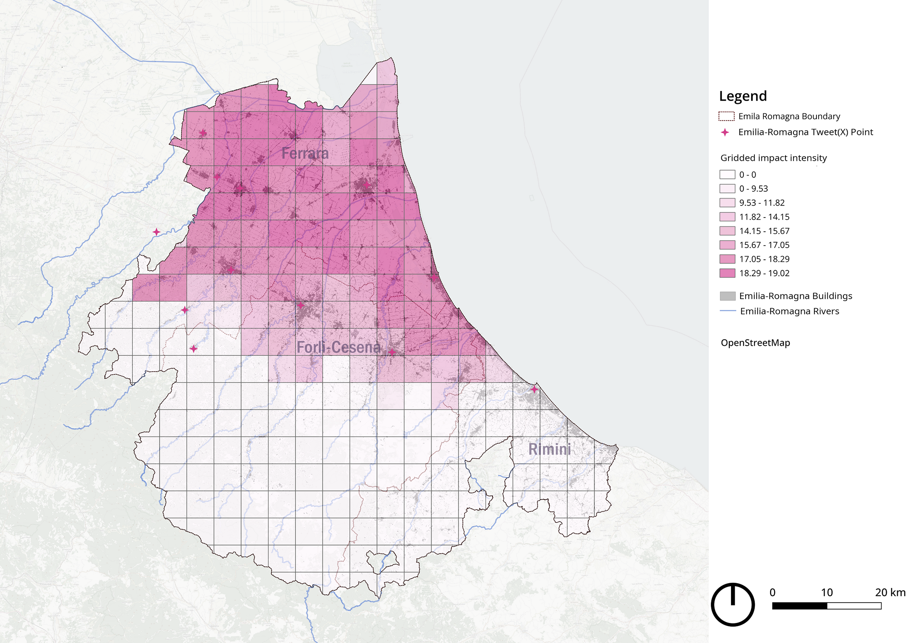 | 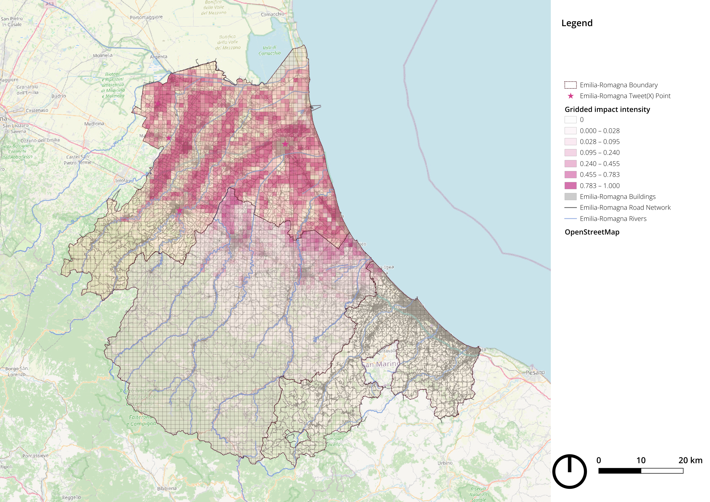 |

### Response and demand visibility R

| Original master's-thesis map (5 km) | Post-thesis QGIS refinement (1 km) |
|---|---|
| 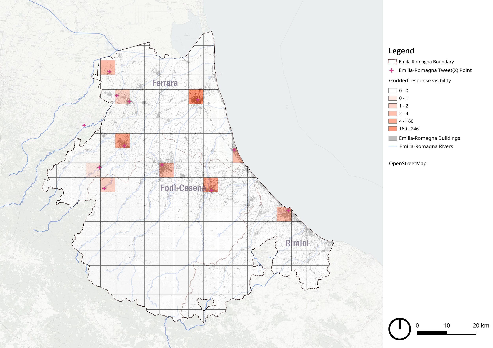 | 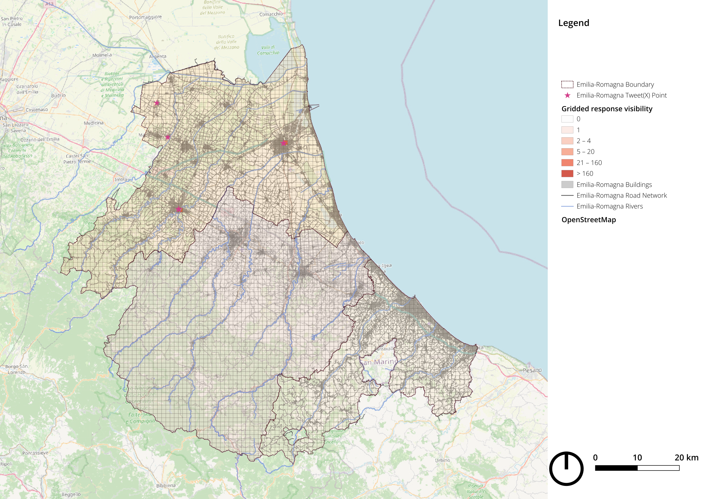 |

### Grid-based mismatch magnitude

| Original master's-thesis map (5 km) | Post-thesis QGIS refinement (1 km) |
|---|---|
| 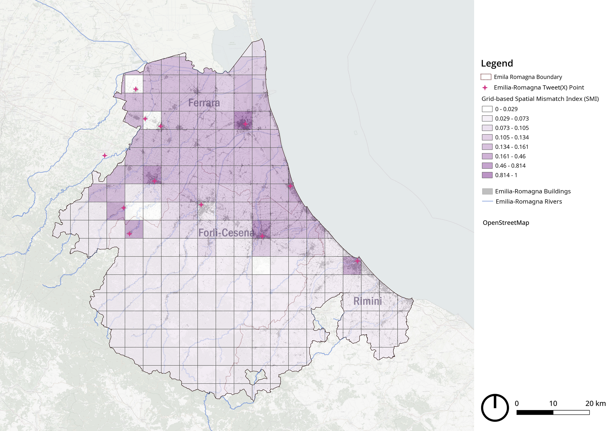 | 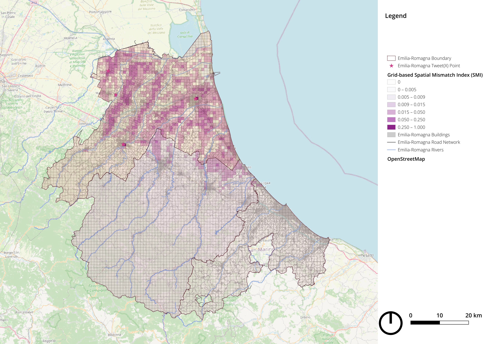 |

This non-negative layer identifies where mismatch magnitude is concentrated.
It is distinct from both the single global SMI value and the signed residual.

### Signed standardised residual SR

| Original master's-thesis map (5 km) | Post-thesis QGIS refinement (1 km) |
|---|---|
| 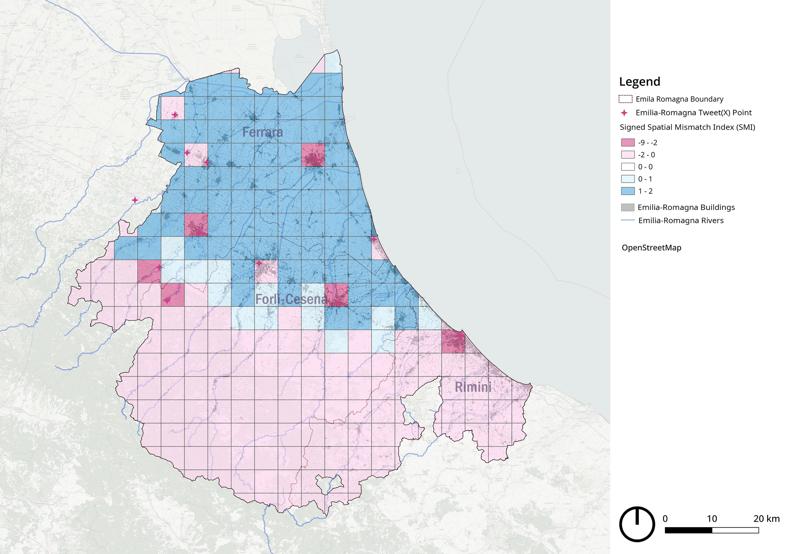 | 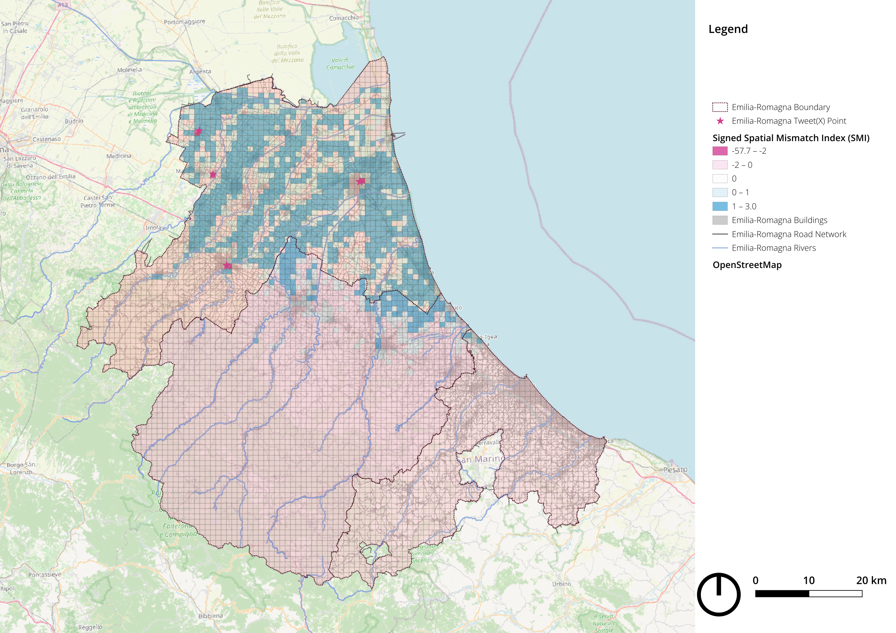 |

Blue indicates impact high relative to visibility; pink indicates visibility
high relative to impact. Exact cell agreement is not expected after the change
in spatial support. The denser OpenStreetMap, building, road, river and boundary
context in the 1 km panels can also make them appear darker when reduced.

## Executable demonstration boundary

The maps and event-window counts documented above are empirical thesis or
post-thesis cartographic outputs. The public Streamlit application is a
separate executable method demonstration that applies the thesis formulas to a
**12-unit synthetic demonstration table**.

Therefore:

- every numerical value displayed by the app is recalculated from the loaded
  demonstration dataset;
- the synthetic SMI is not a fixed property of the Emilia–Romagna flood;
- the synthetic SMI is not presented as the original empirical thesis result;
- response/demand visibility is not equivalent to operational deployment;
- high mismatch values are screening signals requiring triangulation, not
  direct proof of response failure.

The repository demonstrates the analytical and computational logic of the
thesis and publishes the paired cartographic outputs. It does not reproduce the
complete original raster archive, empirical 5 km or 1 km attribute tables, GIS
project, X archive, geocoding workflow or institutional deployment records.

## 1. Research problem

The project asks whether the spatial distribution of realised flood impacts is
aligned with the spatial distribution of response- and demand-related visibility.

The key distinction is:

- **Impact `I_i`**: physically reconstructed flood consequences;
- **Visibility `R_i`**: digitally mediated response and demand signals;
- `R_i` is **not** a direct measurement of operational deployment.

## 2. Analytical framework

The workflow follows four stages:

1. reconstruct physical impact on common spatial units (5 km in the thesis,
   with a 1 km post-thesis refinement);
2. extract, geocode and aggregate response/demand signals;
3. quantify distributional mismatch with the Spatial Mismatch Index;
4. interpret direction and magnitude through the standardised residual surface.

## 3. Material and source structure

### Physical-impact inputs in the thesis

- Copernicus EMS Rapid Mapping inundation footprint;
- OpenStreetMap building footprints;
- OpenStreetMap road and rail networks;
- supporting Sentinel, orthophoto, LiDAR, DEM and administrative layers.

The public executable starts from prepared unit-level ratios; it does not claim
to rerun a complete end-to-end computer-vision model.

### Visibility inputs in the thesis

- geolocated X posts;
- LLM-assisted semantic annotations;
- official civil-protection texts as contextual references, not deployment counts.

The thesis reports:

- 481 records with usable location assignments;
- 450 unique X post IDs;
- 106 event-window records;
- 100 unique analytical posts after deduplication.

## 4. Physical impact intensity

For each spatial unit:

```text
I_i =
w1 * inundation_ratio_i
+ w2 * inundated_building_ratio_i
+ w3 * road_disruption_ratio_i
```

The public baseline uses equal weights. This is a transparent modelling choice,
not an empirically calibrated constant. The thesis states that outputs must be
interpreted conditionally on the weighting choice and that no formal sensitivity
test was completed in the thesis.

## 5. Response and demand visibility

The thesis-core LLM annotation fields are:

- location;
- needs category;
- severity score from 1 to 10;
- sentiment;
- summary.

The repository optionally retains audit additions such as confidence,
geocoding cue and rationale. These additions are described as a revised,
auditable schema aligned with the thesis logic, not as a verbatim copy of the
original thesis prompt.

The non-negative raw visibility intensity is:

```text
R_i = c_i
```

where `c_i` is the semantically filtered, geocoded signal count/intensity in unit
`i`. This raw intensity is used for SMI shares. Log transformation and
z-standardisation are used separately for the directional SR surface.

## 6. Mismatch diagnostics

### Distributional SMI

```text
I_tilde_i = I_i / sum_j(I_j)
R_tilde_i = R_i / sum_j(R_j)
Delta_i = R_tilde_i - I_tilde_i
SMI_i = 0.5 * abs(Delta_i)
SMI = sum_i(SMI_i)
```

- negative `Delta_i`: visibility share is below impact share;
- positive `Delta_i`: visibility share is above impact share;
- `SMI` lies in `[0, 1]` and is recalculated for the supplied dataset.

### Directional standardised residual

```text
I_z_i = z(log(1 + I_i))
R_z_i = z(log(1 + R_i))
SR_i = I_z_i - R_z_i
```

- positive `SR_i`: under-visibility relative to measured impact;
- negative `SR_i`: over-visibility relative to measured impact;
- values near zero: approximate balance by sign/numerical equality;
- mismatch magnitude: min-max rescaling of `abs(SR_i)` to `[0, 1]`.

No empirical `±0.25` classification threshold is defined by the thesis. SMI and
SR answer different questions and must not be treated as the same metric.

## 7. Case-study interpretation

The diagnostic workflow examines:

- urban concentration of digitally visible signals;
- rural and low-lying agricultural cells with high impact and weak visibility;
- accessibility constraints and road-network disruption;
- post-flood intervention layers as qualitative triangulation.

A high mismatch magnitude is a diagnostic zone requiring further investigation.
It is not, by itself, proof of insufficient on-the-ground response.

## 8. Strategic proposal logic

The thesis develops four qualitative proposal groups:

1. spatial planning and infrastructure;
2. watershed management and nature-based solutions;
3. emergency management and institutional reform;
4. community engagement and technology integration.

The code does not present arbitrary numerical thresholds as a validated AI
planning-decision model.

## 9. Run the project

```bash
python -m venv .venv
source .venv/bin/activate
pip install -r requirements.txt
python scripts/run_pipeline.py
pytest -q
streamlit run app.py
```

The command-line script prints the SMI produced by the synthetic input and
explicitly labels it as a demonstration output, not the empirical thesis result.

Open the notebook:

```text
notebooks/Thesis_Aligned_Mismatch_Diagnosis.ipynb
```

## 10. Evidence boundary

The executable grid and post-level examples are synthetic. They demonstrate the
thesis method without claiming to reproduce the original empirical maps. See:

- `docs/SOURCE_AND_PROVENANCE.md`
- `docs/THESIS_LOGIC_MAP.md`
- `docs/REAL_DATA_REPLACEMENT.md`
- `docs/VALIDATION.md`
